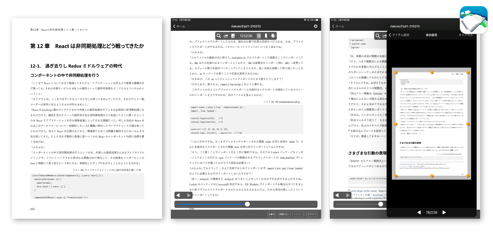
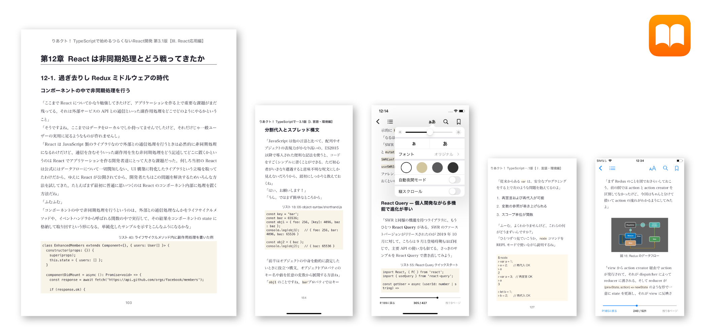
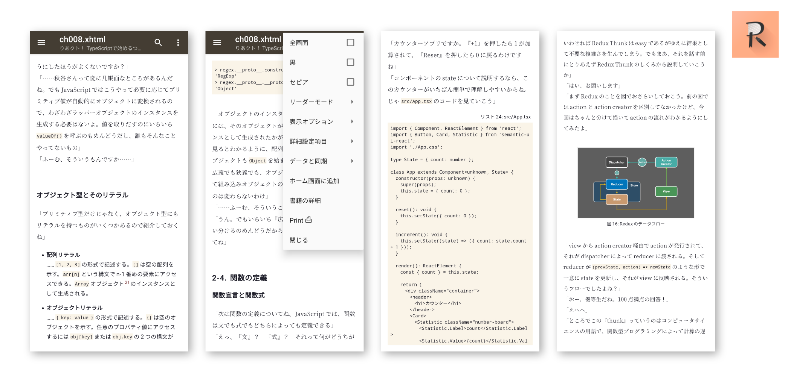
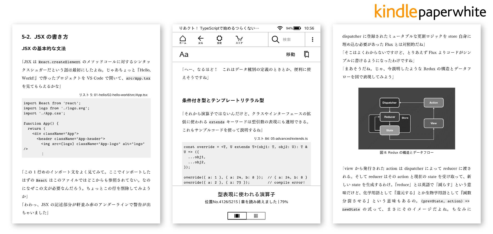

<!-- markdownlint-disable MD024 -->

# よりよい環境で「りあクト！」電子版をお読みいただくために

最終更新日： 2022 年 9 月 8 日

『りあクト！ TypeScript で始めるつらくない React 開発 &nbsp;第 4 版』の電子版では、**PDF** と **EPUB**、**AZW3**（Kindle 端末用）の 3 つの形式のファイルを提供しています。このドキュメントをお読みになり、それぞれの特徴を知った上で、ご自身の環境に最適な方法でお読みください。

 

### 《目次》

- [PDF](#pdf)
  - [PDF フォント事情](#pdf-font)
  - [おすすめの PDF リーダーアプリ](#pdf-reader)
- [EPUB](#epub)
  - [EPUB フォント事情](#epub-font)
  - [1. iOS で EPUB を読む](#epub-ios)
  - [2. Android で EPUB を読む](#epub-android)
  - [3. Mac で EPUB を読む](#epub-mac)
  - [4. Windows で EPUB を読む](#epub-win)
  - [5. Linux で EPUB を読む](#epub-linux)
- [AZW3](#azw3)
  - [AZW3 ファイル事情](#azw3-file)
  - [AZW3 フォント事情](#azw3-font)
  - [AZW3 にまつわる Kindle のバグ](#azw3-bug)

 

## ■ PDF

本書 PDF 版のファイルは、製本された紙の本のデータ原稿である PDF をほぼそのままの形で提供しているものです。原稿は B5 版（182mm × 257mm）でフォント設定はそれに最適化されているため、画面が 12 インチ未満のデバイスでは表示される文字が小さすぎて読みづらいかもしれません。  
（※ iPad mini など 10 インチ以下のタブレットやスマートフォンでの読書は、PDF 版ではなく次章で説明する EPUB 版をご利用ください）

#### ◎ PDF フォント事情

本文のフォントに [筑紫明朝 Pr6](https://fontworks.co.jp/fontsearch/tsukuminpr6-LB/) を使用。インク溜まりが見えるような独特な雰囲気を持った商用のフォントで、小説によく使われています。作風に合わせてこのフォントを選定しました。PDF 版には商用ライセンスに問題ない形で該当フォントが埋め込まれており、ご自身がこのフォントをお持ちでなくてもオリジナルの読み心地がそのまま味わえます。

またソースコードの表示には、プログラミングフォントとして日本では定番ともいわれる [Ricty Diminished](https://github.com/edihbrandon/RictyDiminished) を使用。非常に視認性が高く、縮小表示しても読みにくくなりづらい字体となっています。

#### ◎ おすすめの PDF リーダーアプリ

#### SideBooks &nbsp;★★★★★

iOS および Android 双方のプラットフォームに対応している使い勝手のいい国産アプリです。「余白設定」からページの余白を削ることができ、10〜11 インチサイズの iPad でも比較的快適に読書ができます。

&nbsp;😄&nbsp; 余白設定など、タイトルごとにさまざまな表示設定を適用・保存することが可能  
&nbsp;😄&nbsp; カスタマイズ可能で美しい本棚  
&nbsp;😄&nbsp; ライブラリを Dropbox に保存して複数の端末で共有できる

☞ [SideBooks の App Store ページ（iOS）](https://apps.apple.com/jp/app/sidebooks/id409777225)  
☞ [SideBooks の Google Play ページ（Android）](https://play.google.com/store/apps/details?id=jp.co.tokyo_ip.SideBooks)

 

## ■ EPUB

EPUB ファイルとは所定の形式の XHTML および CSS ファイルを ZIP で圧縮し、拡張子を `.epub` に変更したものです。ですので EPUB での読書は、基本的にはブラウザで Web ページを閲覧するのと同様です。

EPUB では例外的に PDF のように固定レイアウトにすることもできますが、本書で採用しているのは標準的な「リフロー型」です。紙の本のような固定されたページの概念がなく、画面のサイズやその他の表示設定により、一画面に表示できる文字数がフレキシブルに変わります。  
PDF と異なり、小さな画面でも文字が細かすぎて読めなくなるということがなく、また出版社が提供するデフォルトのスタイルから、さらにアプリ側で文字の大きさや行の間隔などをユーザーが好みに合わせて自由に変更できます。

本書は「世界一読みやすい EPUB の技術書」を目指し、大小様々な画面サイズのスマートフォンやタブレットで快適な読書ができるよう、スタイルを細かく調整しています。特に**スマートフォンや 12 インチ未満のタブレットで閲覧する場合は、EPUB 形式を利用されることを強く推奨**します。

#### ◎ EPUB フォント事情

EPUB は ZIP 圧縮によるオープンなファイル形式のため、PDF のように商用フォントをライセンスに問題ない形で埋め込むことができません。基本的にはシステムにインストールされているフォントを使うか、オープンライセンスのフォントを埋め込む形になります。

本書ではソースコードの表示用に [Inconsolata](https://fonts.google.com/specimen/Inconsolata?preview.text_type=custom&preview.text=Riakuto!%20-%20Starting%20React%20with%20TypeScript%20painlessly) を EPUB ファイルに埋め込み、すべてのプラットフォームで優先的に使われるようにしています。

オリジナルの PDF 版でコード用に使われている [Ricty Diminished](https://github.com/edihbrandon/RictyDiminished) は欧文文字に Inconsolata、それ以外に [Circle M+ 1m](http://mix-mplus-ipa.osdn.jp/) を適用した合成フォントですが、膨大な数の全角文字を含むため埋め込みフォントにするには容量が大きすぎます。  
そこで本書の EPUB 版では欧文フォントの Inconsolata だけを埋め込んで使い、コード内のそれ以外の日本語文字などには各プラットフォームの標準の等幅フォントが適用されるようにしています。

本文のフォントについては、オリジナルに準じて端末に [筑紫明朝 Pr6N](https://fontworks.co.jp/fontsearch/tsukuminpr6n-r/) または [筑紫明朝 Pr6](https://fontworks.co.jp/fontsearch/tsukuminpr6-LB/) がインストールされている場合は、それが優先的に表示されます。  
インストールされていなければ、下記にある各プラットフォームのシステム内蔵フォントが使われます。

 

### 1. iOS で EPUB を読む

#### ◎ iOS でのフォント事情

本文の表示については、デフォルトでは [ヒラギノ明朝 ProN](https://fontplus.jp/font-list/hiraminpron-w3) が用いられます。

#### ◎ iOS おすすめの EPUB リーダーアプリ

#### Apple Books &nbsp;★★★★★（iPhone 版：★★★）

iOS および iPadOS にプリインストールされている標準のリーダーアプリ。iOS 11 までは「iBooks」という名前でした。日本語環境ではメニューにはただ「ブック」と表示されます。EPUB、PDF 両フォーマットに対応。  
EPUB 内に添付されるオリジナルの指定スタイルが素直に再現できる iOS 版のリーダーアプリは非常に少なく、iOS ではおすすめできるアプリはこれひとつしかありません。

&nbsp;😄&nbsp; 操作が直感的で、動作も機敏  
&nbsp;😄&nbsp; オリジナル指定スタイルの再現性が高い  
&nbsp;😄&nbsp; ライブラリが iCloud で管理され、複数の端末で蔵書やその読書進捗を共有できる  
&nbsp;😰&nbsp; 画面のマージンが大きく変更不可のため、iPhone 版の狭い画面では 1 ページに表示できる内容が少ない  
&nbsp;😰&nbsp; ページ移動時、「ページめくり」のアニメーション効果が強制される

 

### 2. Android で EPUB を読む

#### ◎ Android でのフォント事情

多くの Android デバイスには明朝体フォントが内蔵されていません。そこで Android 環境でもオリジナル版の読書体験に近づけるべく、本文には Web フォントを用いて [Noto Serif JP](https://fonts.google.com/specimen/Noto+Serif+JP?preview.text_type=custom&preview.text=%E3%82%8A%E3%81%82%E3%82%AF%E3%83%88%EF%BC%81%20TypeScript%20%E3%81%A7%E5%A7%8B%E3%82%81%E3%82%8B%E3%81%A4%E3%82%89%E3%81%8F%E3%81%AA%E3%81%84%20React%20%E9%96%8B%E7%99%BA) が適用されるようになっています。  
ファイルを開いた際、ネットワーク越しにフォントデータが読み込まれるため、通信環境が悪いと正しく表示されるまでに時間がかかります。  
（※ `unicode-range` を用いて 119 分割された最低限のフォントデータが必要に応じて適宜読み込まれるようになっており、Wi-Fi 環境下では遅延はほとんど気にならないレベルです）

なお Web フォントには [Google Fonts](https://fonts.google.com/) のサービスを利用していますが、ここで提供されているフォント形式は全角文字のカーニングが効かないので、必要以上に文字間が開いて他のプラットフォームと読み比べると行が散漫に感じられるかもしれません。

#### ◎ Android おすすめの EPUB リーダーアプリ

#### Reasily &nbsp;★★★★

現時点であまりメジャーなアプリではありませんが、動作が早く操作も直感的、スタイルの再現性も高いため、いくつか欠点はあるものの Android ではこの Reasily がイチ推しです。

&nbsp;😄&nbsp; 競合アプリと比較して動作が機敏  
&nbsp;😄&nbsp; オリジナル指定スタイルの再現性が高い  
&nbsp;😄&nbsp; メニューを隠した全画面表示が可能  
&nbsp;😄&nbsp; ユーザーがインストールしたフォントが本文表示に使用可能  
&nbsp;😰&nbsp; 画面幅に対して横幅が長い表（テーブル）の表示が崩れる  
&nbsp;😰&nbsp; 横ローテートすると強制的に 2 カラム表示になり、スマートフォン程度の画面では横幅が足りず表示がはみ出してしまう

☞ [Reasily の Google Play ページ](https://play.google.com/store/apps/details?id=com.gmail.jxlab.app.reasily)

#### Lithium &nbsp;★★★

&nbsp;😄&nbsp; 競合アプリの中では比較的、表示も崩れず指定スタイルの再現度もまあまあ  
&nbsp;😰&nbsp; 全体的にもっさりとした動作で、特に章をまたいだときの再表示にかかる時間が気になる  
&nbsp;😰&nbsp; 指定スタイルを無視してすべての要素に一律、アプリ設定の `line-height` が適用されてしまう

☞ [Lithium の Google Play ページ](https://play.google.com/store/apps/details?id=com.faultexception.reader)

#### Google Play ブックス &nbsp;★★

&nbsp;😄&nbsp; ライブラリがクラウドで管理されるため、複数の端末で蔵書や読書進捗を共有できる  
&nbsp;😄&nbsp; 明朝体フォントが最初から内蔵されており、Web フォントを使う必要がない  
&nbsp;😰&nbsp; 初回にファイルを開く際、まずファイルをクラウドにアップロードし、さらに変換処理をした上でダウンロードし直されて初めて利用可能になるため、1 分以上待たされる  
&nbsp;😰&nbsp; 指定したフォントの種類を無視して、アプリによる一律のフォントを強制的に適用する

☞ [Google Play ブックス の Google Play ページ](https://play.google.com/store/apps/details?id=com.google.android.apps.books)

 

### 3. Mac で EPUB を読む

#### ◎ Mac でのフォント事情

iOS と同じく、本文の表示には [ヒラギノ明朝 ProN](https://fontplus.jp/font-list/hiraminpron-w3) が用いられます。

#### ◎ Mac おすすめの EPUB リーダーアプリ

#### Adobe Digital Editions &nbsp;★★★★

Adobe が提供する電子書籍リーダー。iOS 版や Android 版、Windows 版も提供されていてそれらの評価は低いが、Mac 版に限っては比較的できがよく、手軽に閲覧するならおすすめできるアプリです。Homebrew でもインストールできます。

&nbsp;😄&nbsp; オリジナル指定スタイルの再現性が高い  
&nbsp;😄&nbsp; 操作が直感的

☞ [Adobe Digital Editions のダウンロードページ](https://www.adobe.com/jp/solutions/ebook/digital-editions/download.html)

#### Apple Books &nbsp;★★★

macOS にプリインストールされている標準のリーダーアプリ。日本語環境ではメニューには「ブック(.app)」と表示されます。

&nbsp;😄&nbsp; オリジナル指定スタイルの再現性が高い  
&nbsp;😄&nbsp; ライブラリが iCloud で管理され、iOS 端末などと蔵書や読書進捗を共有できる  
&nbsp;😰&nbsp; 表示カラム幅が固定でウィンドウのサイズに追随せず、 横幅を広げると強制的に 2 カラム表示になる

 

### 4. Windows で EPUB を読む

#### ◎ Windows でのフォント事情

デフォルトの本文の表示には [游明朝体](https://www.jiyu-kobo.co.jp/library/ymf/) が適用されます。

#### ◎ Windows おすすめの EPUB リーダーアプリ

#### Calibre &nbsp;★★★

Calibre は電子書籍管理アプリですが付属のリーダーである E-book viewer がそこそこ使えるため、競合アプリの弱い Windows では有力な選択肢となりえます。

&nbsp;😄&nbsp; 他の競合アプリと比較して、指定スタイルの再現度はまあまあ  
&nbsp;😰&nbsp; ファイルを開いて最初の画面が表示されるまでに少し時間がかかる

☞ [Calibre のダウンロードページ](https://calibre-ebook.com/download)

#### Thorium Reader &nbsp;★★★

&nbsp;😄&nbsp; タイトルごとに別ウィンドウで開くことができる  
&nbsp;😰&nbsp; 表示カラム幅が固定でウィンドウのサイズに追随せず、 横幅を広げると強制的に 2 カラム表示になる  
&nbsp;😰&nbsp; Windows 版では埋め込みフォントが適切に表示されない

☞ [Thorium Reader の Microsoft Store ページ](https://www.microsoft.com/ja-jp/p/thorium-reader/9nfzp1g7m2sc?activetab=pivot:overviewtab)

 

### 5. Linux で EPUB を読む

#### ◎ Linux でのフォント事情

Linux はディストリビューションによってプリインストールされている日本語フォントの種類が異なりますが、本書では最もシェアが高い Ubuntu（18.04 以降）に合わせてフォント設定を調整しています。  
デフォルトの Ubuntu の環境では本文の表示に [Noto Serif CJK JP](https://www.google.com/get/noto/#serif-jpan)、章タイトルや箇条書きのテキストには [Noto Sans CJK JP](https://www.google.com/get/noto/#sans-jpan) が適用されます。

なお追加で fonts-noto-cjk-extra パッケージも導入していただくと、フォントの太さがよりきめ細やかに設定されるようになります。また Ubuntu 以外のディストリビューションでも、上記に該当するフォントをご自身でインストールされれば適切な表示になります。

#### ◎ Linux おすすめの EPUB リーダーアプリ

#### Calibre &nbsp;★★★

Windows 版と同様、付属の E-book viewer の使い勝手がいいです。Ubuntu を含む Debian 系の Linux ディストリビューションでは、`apt` コマンドで Calibre のインストールが可能です。

&nbsp;😄&nbsp; 他の競合アプリと比較して、指定スタイルの再現度はまあまあ  
&nbsp;😰&nbsp; ファイルを開いて最初の画面が表示されるまでに少し時間がかかる

#### Thorium Reader &nbsp;★★★

&nbsp;😄&nbsp; タイトルごとに別ウィンドウで開くことができる  
&nbsp;😰&nbsp; 表示カラム幅が固定でウィンドウのサイズに追随せず、 横幅を広げると強制的に 2 カラム表示になる

☞ [Thorium Reader のダウンロードページ](https://www.edrlab.org/software/thorium-reader/)

 

## ■ AZW3（Kindle 用）

e-ink スクリーンを採用している、Kindle Paperwhite を始めとした Amazon による電子書籍リーダー専用デバイスで本書を読みたい場合はこの AZW3 フォーマットファイルをお使いください。

Amazon がパーソナルドキュメントを Kindle 端末に転送する方法として EPUB ファイルを指定のメールアドレスに送信することが推奨されていますが、この方法では CSS が勝手に書き換えられて非常に読みづらいフォーマットになってしまいます。くるみ割り書房では提供されている AZW3 ファイルを USB 接続によって転送する方法を強く推奨します。

お手持ちの Kindle 端末に AZW3 ファイルを読み込ませるためには、USB ケーブルで PC に接続してストレージとして Kindle 端末をマウントし、ルートにある `documents` フォルダにファイルをコピーしてください。

なお本書で提供している AZW3 ファイルは、実機で検証を繰り返して Kindle 端末に最適化したスタイルを適用したものとなっています。

#### ◎ AZW3 ファイル事情

BOOTH ではダウンロード商品に `.azw3` 拡張子のファイルを登録できないため、一度 ZIP 圧縮したものを `riakuto4pt[123]-YYMMDD.azw3.zip` のファイル名で登録しています。これを解凍すると `riakuto4pt[123]-YYMMDD.azw3` という形式のファイルができますので、それを Kindle 端末に転送してください。

<!--
なお本書の AZW3 版を提供しているストアは現在、BOOTH のみとなっております。[技術書典オンラインマーケット](https://techbookfest.org/organization/24430006) は 1 タイトルに付き複数ファイルの登録ができず、購入者は PDF と EPUB を ZIP で圧縮したファイルをダウンロードしていただくようになっています。

技術書典オンラインマーケットで購入された方で BOOTH と同等の AZW3 ファイルをご利用になりたい場合は、お手数ですが以下の手順で EPUB ファイルから AZW3 ファイルを作成してください。なおこの手順には、PC に [Sigil](https://github.com/Sigil-Ebook/Sigil/releases) と [calibre](https://calibre-ebook.com/) をインストールしておく必要があります。
（※ 両アプリともパッケージマネージャで Mac なら [Homebrew](https://brew.sh/)、Windows なら [winget](https://docs.microsoft.com/ja-JP/windows/package-manager/winget/) でインストール可能です）

1. Sigil を起動して、該当の EPUB ファイルを開く
1. Sigil のブックブラウザーから `Styles/stylesheet2.css` を開き、中身をこのリポジトリの [epub-azw.css](./assets/epub-azw3.css) の内容にすべて置換して保存する
1. calibre を起動して書き換えた EPUB ファイルを読み込ませ、「本を変換」で出力形式に「AZW3」を選択して実行
1. 「パス: クリックして開く」で変換したファイルの場所を特定
-->

#### ◎ AZW3 フォント事情

日本で販売されている Kindle 端末の最新のシステムには筑紫明朝フォントがインストールされています。オリジナルの PDF 版の読書体験に近づけるために、この筑紫明朝フォントをお使いになることを強くおすすめします。  
ただ Kindle 端末ではファイルの添付スタイルから筑紫明朝フォントを適用することができません。筑紫明朝を使うためには、ユーザーご自身で本を開いているときの設定から「フォント → 筑紫明朝」を選択して、本文に該当フォントを適用してください。

ソースコードの表示には、システム標準の等幅フォントである [Courier](https://fonts.adobe.com/fonts/courier) が使われています。理由のひとつは Kindle 端末で埋め込みフォントを使用すると、フォント設定で「筑紫明朝」を適用したときに本文以外のすべての要素にも筑紫明朝が適用されてしまうという不具合を回避するためです。  
また Kindle 端末の e-ink スクリーンで Courier と Inconsolata を比較してみましたが、むしろこの環境では字体にセリフのある Courier のほうが読みやすいように筆者には感じられました。

なお Kindle 内蔵フォントには絵文字が含まれていないため、本書内の絵文字が使われている部分はいわゆる「豆腐文字」になってしまいます。絵文字フォントをファイルに埋め込めば表示されるようになるのですが、先述の筑紫明朝の問題があり他のフォントが読みづらくなってしまうため、本文の読みやすさを優先させてそのままにしています。ご了承ください。

#### ◎ AZW3 にまつわる Kindle のバグ

2022 年 9 月現在、Kindle 端末はパーソナルドキュメントとして転送された AZW3 形式のドキュメントでも表紙画像をファイル中に設定されたものを無視してサーバから取得しようとし、失敗して表紙画像を表示できなくなるというバグがあります。2020 年 5 月ごろに配信されたバージョンのファームウェアから存在しているバグですが、一向に修正される気配がなくそのままになっています。Amazon によるこのバグのため、上記の方法で Kindle 端末に転送したドキュメントには、一覧から表紙画像が表示されません。ご承知おきください。

【参照記事】

- [Covers for books I send to my e-ink Kindle show up momentarily and then are replaced by a generic cover? - Frequently Asked Questions - calibre](https://manual.calibre-ebook.com/faq.html#covers-for-books-i-send-to-my-e-ink-kindle-show-up-momentarily-and-then-are-replaced-by-a-generic-cover)

